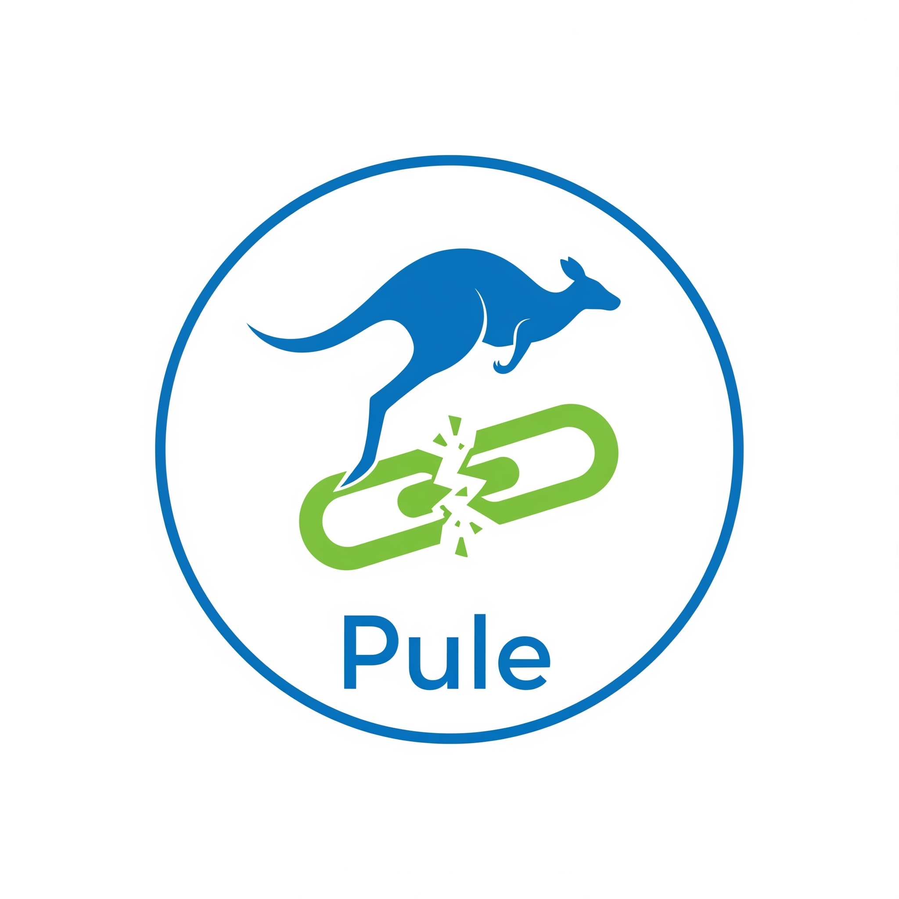

# PEL
> Pule Encurtador de Link.

Bot feito para Discord, onde usuário pode executar o comando que só será exibido para você, para checar o **link de destino**. 
Ótimo se você:

- Não deseja acessar um link desconhecido sem saber seu destino.
- Não deseja ter seus dados coletados.
- Quer saber se é um redirecionamento de links.

---

## Estrutura do bot

- [package.json](package.json) - Usa biblioteca `Discordjs`.
- [index.js](index.js) - Arquivo de execução principal.
- [deploy-commands.js](deploy-commands.js) - Serve para registrar os comandos _slash commands_ no Discord.
- [delete-commands.js](delete-commands.js) - Serve para deletar os comandos _slash commands_ no Discord, em caso de problemas conflitantes futuros.
- [commands/utility/check.js](commands/utility/check.js) - Utilidades dos comandos principais contidos, no caso deste repositório, apenas uma.

---

## Como instalar?

1 - Após clonado com `git clone` e acessado o diretório `PEL`, execute `npm install`.

2 - Configure `.env` 
```
CLIENT_ID=ID
DISCORD_TOKEN=TOKEN
```
3 - Depois, execute `npm run deploy:commands`.

4 - Por fim, execute `npm run start:app`.

> Uma paulada só: `npm run deploy:commands && npm run start:app`

> [!caution]
> Se tiver problemas com comandos que não consiga executar ou aparecer os novos comandos adicionados, execute: `npm run delete:commands`.

---

### Demo


